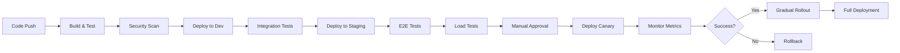

# 10. Deployment Steps - 실제 배포 단계별 가이드

## 🎯 목표
개발 환경에서 프로덕션까지 안전하고 체계적인 배포 프로세스를 수행합니다.

## 📋 Prerequisites
- CI/CD 파이프라인 구축 완료
- 컨테이너 레지스트리 설정 완료
- 프로덕션 인프라 준비 완료
- 모니터링 시스템 활성화
- 롤백 계획 수립

---

## 1. 배포 전략 선택

### 1.1 배포 전략 비교
| 전략 | 다운타임 | 리스크 | 롤백 속도 | 리소스 요구 | 추천 사용 케이스 |
|------|----------|--------|-----------|-------------|------------------|
| Rolling Update | 없음 | 중간 | 느림 | 낮음 | 일반적인 업데이트 |
| Blue-Green | 없음 | 낮음 | 매우 빠름 | 2배 | 중요한 릴리스 |
| Canary | 없음 | 매우 낮음 | 빠름 | 추가 10-20% | 대규모 변경 |
| Recreate | 있음 | 높음 | 보통 | 낮음 | 개발 환경 |
| Shadow | 없음 | 매우 낮음 | 해당없음 | 2배 | 성능 테스트 |

### 1.2 추천 배포 전략: Blue-Green + Canary
```
Production Traffic (100%)
         │
         ├──→ Blue (Current - 90%)
         │
         └──→ Green (New - 10% Canary)
                    │
                    ├─ Monitor 30 mins
                    │
                    └─ Gradual increase:
                       10% → 25% → 50% → 100%
```

---

## 2. 배포 파이프라인

### 2.1 배포 플로우


### 2.2 자동화된 배포 스크립트
**scripts/deploy.sh**
```bash
#!/bin/bash
set -e

# 설정
ENVIRONMENT=${1:-staging}
VERSION=${2:-latest}
NAMESPACE="game-${ENVIRONMENT}"
DEPLOYMENT="game-server"
CANARY_PERCENTAGE=10
MONITORING_DURATION=1800  # 30분

# 색상 코드
RED='\033[0;31m'
GREEN='\033[0;32m'
YELLOW='\033[1;33m'
NC='\033[0m'

log() {
    echo -e "${GREEN}[$(date +'%Y-%m-%d %H:%M:%S')]${NC} $1"
}

error() {
    echo -e "${RED}[ERROR]${NC} $1" >&2
    exit 1
}

warning() {
    echo -e "${YELLOW}[WARNING]${NC} $1"
}

# 사전 검증
validate_prerequisites() {
    log "Validating prerequisites..."
    
    # kubectl 연결 확인
    kubectl cluster-info &>/dev/null || error "Cannot connect to Kubernetes cluster"
    
    # 네임스페이스 확인
    kubectl get namespace $NAMESPACE &>/dev/null || error "Namespace $NAMESPACE not found"
    
    # 이미지 존재 확인
    docker manifest inspect "${REGISTRY}/${IMAGE}:${VERSION}" &>/dev/null || error "Image not found"
    
    # 헬스체크 엔드포인트 확인
    HEALTH_URL=$(kubectl get ingress -n $NAMESPACE game-ingress -o jsonpath='{.spec.rules[0].host}')
    curl -sf "https://${HEALTH_URL}/health" &>/dev/null || warning "Health endpoint not responding"
    
    log "Prerequisites validated ✓"
}

# 현재 상태 백업
backup_current_state() {
    log "Backing up current deployment state..."
    
    kubectl get deployment -n $NAMESPACE $DEPLOYMENT -o yaml > "/tmp/backup-${DEPLOYMENT}-$(date +%s).yaml"
    kubectl get configmap -n $NAMESPACE -o yaml > "/tmp/backup-configmaps-$(date +%s).yaml"
    
    log "Backup completed ✓"
}

# Blue-Green 배포
deploy_blue_green() {
    log "Starting Blue-Green deployment..."
    
    # Green 환경 생성
    kubectl apply -f - <<EOF
apiVersion: apps/v1
kind: Deployment
metadata:
  name: ${DEPLOYMENT}-green
  namespace: ${NAMESPACE}
  labels:
    app: game-server
    version: green
spec:
  replicas: $(kubectl get deployment -n $NAMESPACE ${DEPLOYMENT}-blue -o jsonpath='{.spec.replicas}')
  selector:
    matchLabels:
      app: game-server
      version: green
  template:
    metadata:
      labels:
        app: game-server
        version: green
    spec:
      containers:
      - name: game-server
        image: ${REGISTRY}/${IMAGE}:${VERSION}
        ports:
        - containerPort: 8080
        env:
        - name: VERSION
          value: "${VERSION}"
        - name: DEPLOYMENT_TYPE
          value: "green"
        resources:
          requests:
            memory: "2Gi"
            cpu: "1000m"
          limits:
            memory: "4Gi"
            cpu: "2000m"
        livenessProbe:
          httpGet:
            path: /health
            port: 8080
          initialDelaySeconds: 30
          periodSeconds: 10
        readinessProbe:
          httpGet:
            path: /ready
            port: 8080
          initialDelaySeconds: 10
          periodSeconds: 5
EOF
    
    # Green 배포 대기
    log "Waiting for Green deployment to be ready..."
    kubectl rollout status deployment/${DEPLOYMENT}-green -n $NAMESPACE --timeout=600s
    
    # Green 헬스체크
    GREEN_POD=$(kubectl get pods -n $NAMESPACE -l version=green -o jsonpath='{.items[0].metadata.name}')
    kubectl exec -n $NAMESPACE $GREEN_POD -- curl -sf http://localhost:8080/health || error "Green health check failed"
    
    log "Green deployment ready ✓"
}

# Canary 배포
deploy_canary() {
    log "Starting Canary deployment (${CANARY_PERCENTAGE}% traffic)..."
    
    # Istio VirtualService로 트래픽 분할
    kubectl apply -f - <<EOF
apiVersion: networking.istio.io/v1beta1
kind: VirtualService
metadata:
  name: game-server-vs
  namespace: ${NAMESPACE}
spec:
  hosts:
  - game-server
  http:
  - match:
    - headers:
        canary:
          exact: "true"
    route:
    - destination:
        host: game-server
        subset: green
  - route:
    - destination:
        host: game-server
        subset: blue
      weight: $((100 - CANARY_PERCENTAGE))
    - destination:
        host: game-server
        subset: green
      weight: ${CANARY_PERCENTAGE}
EOF
    
    log "Canary traffic split configured ✓"
}

# 메트릭 모니터링
monitor_deployment() {
    log "Monitoring deployment metrics for ${MONITORING_DURATION} seconds..."
    
    START_TIME=$(date +%s)
    END_TIME=$((START_TIME + MONITORING_DURATION))
    
    while [ $(date +%s) -lt $END_TIME ]; do
        # 에러율 체크
        ERROR_RATE=$(prometheus_query 'rate(game_errors_total[5m])')
        if (( $(echo "$ERROR_RATE > 0.01" | bc -l) )); then
            error "Error rate too high: ${ERROR_RATE}"
        fi
        
        # 레이턴시 체크
        P95_LATENCY=$(prometheus_query 'histogram_quantile(0.95, rate(game_request_duration_seconds_bucket[5m]))')
        if (( $(echo "$P95_LATENCY > 0.5" | bc -l) )); then
            warning "P95 latency high: ${P95_LATENCY}s"
        fi
        
        # CPU/메모리 체크
        CPU_USAGE=$(kubectl top pods -n $NAMESPACE -l version=green --no-headers | awk '{print $2}' | sed 's/m//' | awk '{sum+=$1} END {print sum/NR}')
        if [ $CPU_USAGE -gt 1500 ]; then
            warning "High CPU usage: ${CPU_USAGE}m"
        fi
        
        # 진행 상황 출력
        ELAPSED=$(($(date +%s) - START_TIME))
        PROGRESS=$((ELAPSED * 100 / MONITORING_DURATION))
        echo -ne "\rMonitoring progress: [${PROGRESS}%] Errors: ${ERROR_RATE} | P95: ${P95_LATENCY}s | CPU: ${CPU_USAGE}m"
        
        sleep 30
    done
    
    echo ""
    log "Monitoring completed successfully ✓"
}

# Prometheus 쿼리 헬퍼
prometheus_query() {
    local query=$1
    curl -s "http://prometheus:9090/api/v1/query?query=${query}" | jq -r '.data.result[0].value[1]' 2>/dev/null || echo "0"
}

# 점진적 롤아웃
gradual_rollout() {
    log "Starting gradual rollout..."
    
    local weights=(25 50 75 100)
    
    for weight in "${weights[@]}"; do
        log "Increasing traffic to ${weight}%..."
        
        kubectl patch virtualservice game-server-vs -n $NAMESPACE --type merge -p "{
            \"spec\": {
                \"http\": [{
                    \"route\": [
                        {\"destination\": {\"host\": \"game-server\", \"subset\": \"blue\"}, \"weight\": $((100 - weight))},
                        {\"destination\": {\"host\": \"game-server\", \"subset\": \"green\"}, \"weight\": ${weight}}
                    ]
                }]
            }
        }"
        
        # 각 단계에서 모니터링
        monitor_deployment
        
        # 사용자 확인 (프로덕션에서만)
        if [ "$ENVIRONMENT" == "production" ] && [ $weight -lt 100 ]; then
            read -p "Continue rollout to next stage? (y/n) " -n 1 -r
            echo
            if [[ ! $REPLY =~ ^[Yy]$ ]]; then
                error "Rollout cancelled by user"
            fi
        fi
    done
    
    log "Gradual rollout completed ✓"
}

# Blue 환경 정리
cleanup_blue() {
    log "Switching Blue to Green..."
    
    # Green을 새로운 Blue로 전환
    kubectl delete deployment ${DEPLOYMENT}-blue -n $NAMESPACE --ignore-not-found=true
    kubectl patch deployment ${DEPLOYMENT}-green -n $NAMESPACE -p '{"metadata":{"name":"'${DEPLOYMENT}'-blue"}}'
    
    # 서비스 업데이트
    kubectl patch service game-server -n $NAMESPACE -p '{"spec":{"selector":{"version":"blue"}}}'
    
    log "Blue-Green switch completed ✓"
}

# 롤백
rollback() {
    error "Rollback triggered!"
    
    log "Rolling back to previous version..."
    
    # VirtualService를 100% Blue로 복원
    kubectl patch virtualservice game-server-vs -n $NAMESPACE --type merge -p '{
        "spec": {
            "http": [{
                "route": [
                    {"destination": {"host": "game-server", "subset": "blue"}, "weight": 100}
                ]
            }]
        }
    }'
    
    # Green 삭제
    kubectl delete deployment ${DEPLOYMENT}-green -n $NAMESPACE --ignore-not-found=true
    
    # 백업에서 복원
    if [ -f "/tmp/backup-${DEPLOYMENT}-*.yaml" ]; then
        kubectl apply -f /tmp/backup-${DEPLOYMENT}-*.yaml
    fi
    
    log "Rollback completed ✓"
    exit 0
}

# 배포 후 검증
post_deployment_validation() {
    log "Running post-deployment validation..."
    
    # 스모크 테스트
    ./scripts/smoke-tests.sh "https://${HEALTH_URL}"
    
    # 기능 테스트
    kubectl run test-pod --rm -i --restart=Never --image=curlimages/curl -- \
        sh -c "for i in {1..10}; do curl -sf http://game-server:8080/api/v1/status || exit 1; done"
    
    # 데이터베이스 연결 확인
    kubectl exec -n $NAMESPACE deployment/${DEPLOYMENT}-blue -- \
        sh -c "nc -zv mysql 3306 && nc -zv redis 6379"
    
    log "Post-deployment validation completed ✓"
}

# 배포 알림
send_notification() {
    local status=$1
    local message=$2
    
    # Slack 알림
    curl -X POST $SLACK_WEBHOOK \
        -H 'Content-Type: application/json' \
        -d "{
            \"text\": \"Deployment ${status}\",
            \"attachments\": [{
                \"color\": \"$([ "$status" == "SUCCESS" ] && echo "good" || echo "danger")\",
                \"fields\": [
                    {\"title\": \"Environment\", \"value\": \"${ENVIRONMENT}\", \"short\": true},
                    {\"title\": \"Version\", \"value\": \"${VERSION}\", \"short\": true},
                    {\"title\": \"Message\", \"value\": \"${message}\"}
                ]
            }]
        }"
    
    # 이메일 알림 (옵션)
    if [ -n "$EMAIL_RECIPIENTS" ]; then
        echo "$message" | mail -s "Deployment ${status}: ${ENVIRONMENT}" $EMAIL_RECIPIENTS
    fi
}

# 메인 배포 프로세스
main() {
    log "=== Starting deployment to ${ENVIRONMENT} ==="
    log "Version: ${VERSION}"
    
    # 트랩 설정 (에러 시 롤백)
    trap rollback ERR
    
    # 1. 사전 검증
    validate_prerequisites
    
    # 2. 현재 상태 백업
    backup_current_state
    
    # 3. Blue-Green 배포
    deploy_blue_green
    
    # 4. Canary 배포
    deploy_canary
    
    # 5. 초기 모니터링
    monitor_deployment
    
    # 6. 점진적 롤아웃
    gradual_rollout
    
    # 7. Blue 환경 정리
    cleanup_blue
    
    # 8. 배포 후 검증
    post_deployment_validation
    
    # 9. 성공 알림
    send_notification "SUCCESS" "Deployment completed successfully"
    
    log "=== Deployment completed successfully ==="
}

# 실행
main "$@"
```

---

## 3. Kubernetes 매니페스트

### 3.1 기본 Deployment
**k8s/deployment.yaml**
```yaml
apiVersion: apps/v1
kind: Deployment
metadata:
  name: game-server
  namespace: game-production
  labels:
    app: game-server
    version: v1.0.0
  annotations:
    deployment.kubernetes.io/revision: "1"
spec:
  replicas: 5
  revisionHistoryLimit: 10
  strategy:
    type: RollingUpdate
    rollingUpdate:
      maxSurge: 2
      maxUnavailable: 1
  selector:
    matchLabels:
      app: game-server
  template:
    metadata:
      labels:
        app: game-server
        version: v1.0.0
      annotations:
        prometheus.io/scrape: "true"
        prometheus.io/port: "9090"
        prometheus.io/path: "/metrics"
    spec:
      serviceAccountName: game-server
      
      # 노드 선택
      nodeSelector:
        node-type: game-server
      
      # 안티 어피니티 (고가용성)
      affinity:
        podAntiAffinity:
          preferredDuringSchedulingIgnoredDuringExecution:
          - weight: 100
            podAffinityTerm:
              labelSelector:
                matchExpressions:
                - key: app
                  operator: In
                  values:
                  - game-server
              topologyKey: kubernetes.io/hostname
      
      # 톨러레이션
      tolerations:
      - key: "dedicated"
        operator: "Equal"
        value: "game-server"
        effect: "NoSchedule"
      
      # 초기화 컨테이너
      initContainers:
      - name: wait-for-db
        image: busybox:1.35
        command: ['sh', '-c', 'until nc -zv mysql 3306; do echo waiting for db; sleep 2; done']
      
      - name: run-migrations
        image: ${REGISTRY}/game-server:${VERSION}
        command: ["/app/migrate", "--up"]
        env:
        - name: DB_HOST
          valueFrom:
            secretKeyRef:
              name: game-db-secret
              key: host
      
      # 메인 컨테이너
      containers:
      - name: game-server
        image: ${REGISTRY}/game-server:${VERSION}
        imagePullPolicy: IfNotPresent
        
        ports:
        - name: game
          containerPort: 8080
          protocol: TCP
        - name: metrics
          containerPort: 9090
          protocol: TCP
        
        # 환경 변수
        env:
        - name: SERVER_NAME
          valueFrom:
            fieldRef:
              fieldPath: metadata.name
        - name: POD_IP
          valueFrom:
            fieldRef:
              fieldPath: status.podIP
        - name: NODE_NAME
          valueFrom:
            fieldRef:
              fieldPath: spec.nodeName
        - name: NAMESPACE
          valueFrom:
            fieldRef:
              fieldPath: metadata.namespace
        
        # ConfigMap
        envFrom:
        - configMapRef:
            name: game-config
        - secretRef:
            name: game-secrets
        
        # 리소스
        resources:
          requests:
            memory: "2Gi"
            cpu: "1000m"
            ephemeral-storage: "1Gi"
          limits:
            memory: "4Gi"
            cpu: "2000m"
            ephemeral-storage: "2Gi"
        
        # 헬스체크
        livenessProbe:
          httpGet:
            path: /health
            port: 8080
            httpHeaders:
            - name: X-Probe-Type
              value: liveness
          initialDelaySeconds: 60
          periodSeconds: 10
          timeoutSeconds: 5
          successThreshold: 1
          failureThreshold: 3
        
        readinessProbe:
          httpGet:
            path: /ready
            port: 8080
            httpHeaders:
            - name: X-Probe-Type
              value: readiness
          initialDelaySeconds: 10
          periodSeconds: 5
          timeoutSeconds: 3
          successThreshold: 1
          failureThreshold: 3
        
        startupProbe:
          httpGet:
            path: /startup
            port: 8080
          initialDelaySeconds: 0
          periodSeconds: 10
          timeoutSeconds: 3
          successThreshold: 1
          failureThreshold: 30
        
        # 볼륨 마운트
        volumeMounts:
        - name: config
          mountPath: /app/config
          readOnly: true
        - name: tls-certs
          mountPath: /app/certs
          readOnly: true
        - name: temp
          mountPath: /tmp
        
        # 보안 컨텍스트
        securityContext:
          runAsNonRoot: true
          runAsUser: 1000
          runAsGroup: 1000
          allowPrivilegeEscalation: false
          readOnlyRootFilesystem: true
          capabilities:
            drop:
            - ALL
            add:
            - NET_BIND_SERVICE
        
        # 라이프사이클 훅
        lifecycle:
          preStop:
            exec:
              command: ["/app/graceful-shutdown.sh"]
      
      # 볼륨
      volumes:
      - name: config
        configMap:
          name: game-config
          defaultMode: 0444
      - name: tls-certs
        secret:
          secretName: game-tls
          defaultMode: 0400
      - name: temp
        emptyDir:
          sizeLimit: 1Gi
      
      # 종료 유예 기간
      terminationGracePeriodSeconds: 30
      
      # DNS 정책
      dnsPolicy: ClusterFirst
      dnsConfig:
        options:
        - name: ndots
          value: "2"
        - name: edns0
      
      # 이미지 풀 시크릿
      imagePullSecrets:
      - name: registry-secret
```

### 3.2 Service 및 Ingress
**k8s/service.yaml**
```yaml
apiVersion: v1
kind: Service
metadata:
  name: game-server
  namespace: game-production
  labels:
    app: game-server
  annotations:
    service.beta.kubernetes.io/aws-load-balancer-type: "nlb"
    service.beta.kubernetes.io/aws-load-balancer-cross-zone-load-balancing-enabled: "true"
spec:
  type: LoadBalancer
  selector:
    app: game-server
  ports:
  - name: game
    port: 8080
    targetPort: 8080
    protocol: TCP
  - name: metrics
    port: 9090
    targetPort: 9090
    protocol: TCP
  sessionAffinity: ClientIP
  sessionAffinityConfig:
    clientIP:
      timeoutSeconds: 10800
---
apiVersion: networking.k8s.io/v1
kind: Ingress
metadata:
  name: game-ingress
  namespace: game-production
  annotations:
    kubernetes.io/ingress.class: nginx
    cert-manager.io/cluster-issuer: letsencrypt-prod
    nginx.ingress.kubernetes.io/ssl-redirect: "true"
    nginx.ingress.kubernetes.io/websocket-services: game-server
    nginx.ingress.kubernetes.io/proxy-body-size: "10m"
    nginx.ingress.kubernetes.io/proxy-read-timeout: "3600"
    nginx.ingress.kubernetes.io/proxy-send-timeout: "3600"
spec:
  tls:
  - hosts:
    - game.example.com
    secretName: game-tls
  rules:
  - host: game.example.com
    http:
      paths:
      - path: /
        pathType: Prefix
        backend:
          service:
            name: game-server
            port:
              number: 8080
```

---

## 4. 배포 검증

### 4.1 스모크 테스트
**scripts/smoke-test.sh**
```bash
#!/bin/bash

URL=$1
TESTS_PASSED=0
TESTS_FAILED=0

run_test() {
    local test_name=$1
    local command=$2
    
    echo -n "Testing $test_name... "
    if eval $command &>/dev/null; then
        echo "✅ PASSED"
        ((TESTS_PASSED++))
    else
        echo "❌ FAILED"
        ((TESTS_FAILED++))
    fi
}

# 테스트 실행
run_test "Health endpoint" "curl -sf $URL/health"
run_test "Ready endpoint" "curl -sf $URL/ready"
run_test "Metrics endpoint" "curl -sf $URL:9090/metrics"
run_test "API status" "curl -sf $URL/api/v1/status"
run_test "WebSocket connection" "websocat -t1 ws://$URL/ws echo"
run_test "Database connectivity" "curl -sf $URL/api/v1/db-check"
run_test "Redis connectivity" "curl -sf $URL/api/v1/cache-check"

# 결과 출력
echo ""
echo "Results: $TESTS_PASSED passed, $TESTS_FAILED failed"

if [ $TESTS_FAILED -gt 0 ]; then
    exit 1
fi
```

### 4.2 성능 검증
**scripts/performance-check.sh**
```bash
#!/bin/bash

# 부하 테스트
echo "Running performance test..."

k6 run - <<EOF
import http from 'k6/http';
import { check } from 'k6';

export let options = {
    stages: [
        { duration: '1m', target: 100 },
        { duration: '3m', target: 100 },
        { duration: '1m', target: 0 },
    ],
    thresholds: {
        http_req_duration: ['p(95)<500'],
        http_req_failed: ['rate<0.1'],
    },
};

export default function() {
    let res = http.get('$URL/api/v1/status');
    check(res, {
        'status is 200': (r) => r.status === 200,
        'response time < 500ms': (r) => r.timings.duration < 500,
    });
}
EOF

echo "Performance test completed"
```

---

## 5. 배포 모니터링

### 5.1 실시간 모니터링 대시보드
```bash
# Grafana 대시보드 열기
echo "Opening monitoring dashboards..."
echo "Grafana: http://localhost:3000"
echo "Prometheus: http://localhost:9090"
echo "Jaeger: http://localhost:16686"

# 실시간 로그 확인
kubectl logs -f deployment/game-server -n game-production --all-containers=true

# 메트릭 확인
kubectl top pods -n game-production
kubectl top nodes
```

### 5.2 배포 메트릭 쿼리
```promql
# 배포 성공률
sum(rate(deployment_success_total[5m])) / sum(rate(deployment_total[5m]))

# 평균 배포 시간
histogram_quantile(0.5, rate(deployment_duration_seconds_bucket[1h]))

# 롤백 빈도
sum(increase(deployment_rollback_total[24h]))

# 에러율 변화
delta(rate(game_errors_total[5m])[30m:5m])
```

---

## 6. 트러블슈팅

### 6.1 일반적인 문제 해결
```bash
# Pod가 시작되지 않을 때
kubectl describe pod <pod-name> -n game-production
kubectl logs <pod-name> -n game-production --previous

# 이미지 풀 실패
kubectl get events -n game-production --sort-by='.lastTimestamp'
kubectl create secret docker-registry registry-secret \
    --docker-server=$REGISTRY \
    --docker-username=$USERNAME \
    --docker-password=$PASSWORD

# 리소스 부족
kubectl describe nodes
kubectl get resourcequota -n game-production
kubectl top nodes
kubectl top pods -n game-production

# 네트워크 문제
kubectl exec -it <pod-name> -n game-production -- nc -zv mysql 3306
kubectl exec -it <pod-name> -n game-production -- nslookup game-server
```

### 6.2 긴급 롤백
```bash
#!/bin/bash
# emergency-rollback.sh

NAMESPACE=game-production
DEPLOYMENT=game-server

# 이전 버전으로 즉시 롤백
kubectl rollout undo deployment/$DEPLOYMENT -n $NAMESPACE

# 롤백 상태 확인
kubectl rollout status deployment/$DEPLOYMENT -n $NAMESPACE

# 트래픽을 이전 버전으로 100% 전환
kubectl patch virtualservice game-server-vs -n $NAMESPACE --type merge -p '{
    "spec": {
        "http": [{
            "route": [{
                "destination": {
                    "host": "game-server",
                    "subset": "stable"
                },
                "weight": 100
            }]
        }]
    }
}'

# 알림 전송
curl -X POST $SLACK_WEBHOOK \
    -H 'Content-Type: application/json' \
    -d '{"text":"🚨 Emergency rollback executed for game-server"}'
```

---

## ✅ 체크리스트

### 배포 전
- [ ] 코드 리뷰 완료
- [ ] 테스트 통과
- [ ] 보안 스캔 통과
- [ ] 변경 사항 문서화
- [ ] 롤백 계획 준비
- [ ] 배포 일정 공지

### 배포 중
- [ ] 백업 생성
- [ ] 모니터링 대시보드 확인
- [ ] 점진적 롤아웃 수행
- [ ] 헬스체크 통과
- [ ] 성능 메트릭 확인

### 배포 후
- [ ] 스모크 테스트 실행
- [ ] 사용자 피드백 모니터링
- [ ] 로그 분석
- [ ] 성능 보고서 작성
- [ ] 문서 업데이트
- [ ] 레트로스펙티브

## 🎯 다음 단계
→ [11_rollback_plan.md](11_rollback_plan.md) - 롤백 계획