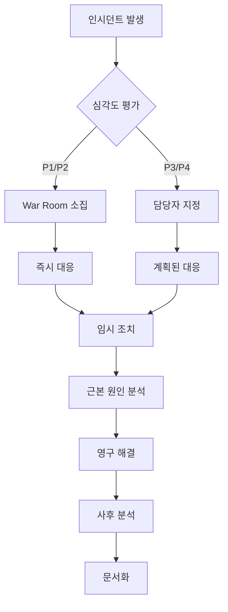

# 12. Operation Runbook - 운영 런북

## 🎯 목표
게임 서버 운영 중 발생할 수 있는 모든 상황에 대한 표준 운영 절차(SOP)를 제공합니다.

## 📋 Prerequisites
- 운영 환경 접근 권한
- 모니터링 대시보드 접근
- 긴급 연락망 구성
- 백업/복구 도구
- 운영 스크립트

---

## 1. 일상 운영 체크리스트

### 1.1 일일 점검 (매일 오전 9시)
```bash
#!/bin/bash
# daily-check.sh

echo "=== Daily Health Check $(date) ==="

# 1. 서버 상태 확인
echo "1. Checking server status..."
kubectl get pods -n game-production | grep -v Running
kubectl top nodes
kubectl top pods -n game-production

# 2. 데이터베이스 확인
echo "2. Checking database..."
mysql -h $DB_HOST -u admin -p$DB_PASS -e "
    SELECT 
        COUNT(*) as active_connections 
    FROM information_schema.processlist;
    
    SHOW STATUS LIKE 'Threads_connected';
    SHOW STATUS LIKE 'Slow_queries';
"

# 3. Redis 상태
echo "3. Checking Redis..."
redis-cli -h $REDIS_HOST INFO server
redis-cli -h $REDIS_HOST INFO memory
redis-cli -h $REDIS_HOST --latency

# 4. 디스크 사용량
echo "4. Checking disk usage..."
df -h | grep -E '(8[0-9]|9[0-9]|100)%'

# 5. 로그 에러 확인
echo "5. Checking error logs..."
kubectl logs -n game-production -l app=game-server --since=24h | grep ERROR | wc -l

# 6. 알림 확인
echo "6. Checking alerts..."
curl -s http://alertmanager:9093/api/v1/alerts | jq '.data[] | select(.status.state=="active")'

echo "=== Check Complete ==="
```

### 1.2 주간 점검 (매주 월요일)
```yaml
weekly_tasks:
  - name: "백업 검증"
    script: verify-backups.sh
    owner: ops-team
    
  - name: "보안 패치 확인"
    script: check-security-updates.sh
    owner: security-team
    
  - name: "성능 리포트 생성"
    script: generate-performance-report.sh
    owner: platform-team
    
  - name: "용량 계획 검토"
    script: capacity-planning.sh
    owner: infrastructure-team
    
  - name: "인시던트 리뷰"
    meeting: "Monday 2PM"
    participants: ["ops", "dev", "product"]
```

---

## 2. 인시던트 대응

### 2.1 인시던트 레벨 정의
| 레벨 | 설명 | 대응 시간 | 에스컬레이션 |
|------|------|-----------|--------------|
| P1 (Critical) | 전체 서비스 다운 | 즉시 | CTO/VP |
| P2 (High) | 주요 기능 장애 | 15분 | Team Lead |
| P3 (Medium) | 일부 기능 저하 | 1시간 | On-call |
| P4 (Low) | 마이너 이슈 | 업무시간 내 | Team |

### 2.2 인시던트 대응 플로우


### 2.3 War Room 프로토콜
```markdown
## War Room 체크리스트

### 역할 지정
- [ ] Incident Commander: 전체 지휘
- [ ] Technical Lead: 기술적 해결
- [ ] Communications: 고객/내부 소통
- [ ] Scribe: 기록 담당

### 초기 대응 (0-15분)
- [ ] 영향 범위 파악
- [ ] 임시 조치 실행
- [ ] 이해관계자 알림
- [ ] 타임라인 기록 시작

### 진행 중 (15분-해결)
- [ ] 15분마다 상태 업데이트
- [ ] 필요시 추가 인력 요청
- [ ] 고객 공지 발송
- [ ] 롤백 옵션 검토

### 해결 후
- [ ] 서비스 정상화 확인
- [ ] 모니터링 강화
- [ ] RCA 일정 잡기
- [ ] 초기 리포트 작성
```

---

## 3. 일반적인 문제 해결

### 3.1 서버 높은 CPU 사용률
```bash
#!/bin/bash
# troubleshoot-high-cpu.sh

echo "=== High CPU Troubleshooting ==="

# 1. TOP 프로세스 확인
echo "Top CPU consuming processes:"
kubectl exec -n game-production deployment/game-server -- top -b -n 1 | head -20

# 2. 스레드 덤프
echo "Getting thread dump..."
kubectl exec -n game-production deployment/game-server -- kill -3 1
kubectl logs -n game-production deployment/game-server --tail=1000 > thread-dump.log

# 3. 프로파일링 활성화
echo "Enabling profiling..."
kubectl exec -n game-production deployment/game-server -- curl -X POST http://localhost:9090/debug/pprof/profile?seconds=30 > cpu-profile.prof

# 4. 자동 스케일링 확인
echo "Checking autoscaling status:"
kubectl get hpa -n game-production

# 5. 임시 조치
read -p "Scale up pods? (y/n) " -n 1 -r
if [[ $REPLY =~ ^[Yy]$ ]]; then
    kubectl scale deployment/game-server -n game-production --replicas=10
fi
```

### 3.2 메모리 누수 대응
```bash
#!/bin/bash
# troubleshoot-memory-leak.sh

# 1. 메모리 사용량 확인
kubectl top pods -n game-production --containers

# 2. 힙 덤프 생성
POD=$(kubectl get pods -n game-production -l app=game-server -o jsonpath='{.items[0].metadata.name}')
kubectl exec -n game-production $POD -- jmap -dump:format=b,file=/tmp/heap.hprof 1
kubectl cp game-production/$POD:/tmp/heap.hprof ./heap-$(date +%s).hprof

# 3. 메모리 분석
echo "Analyzing memory..."
jhat -J-Xmx4g heap-*.hprof

# 4. 재시작 (임시 조치)
kubectl rollout restart deployment/game-server -n game-production
```

### 3.3 데이터베이스 슬로우 쿼리
```sql
-- slow-query-analysis.sql

-- 현재 실행 중인 쿼리
SELECT 
    id,
    user,
    time,
    state,
    LEFT(info, 100) as query
FROM information_schema.processlist
WHERE time > 10
ORDER BY time DESC;

-- 슬로우 쿼리 로그 분석
SELECT 
    query_time,
    lock_time,
    rows_sent,
    rows_examined,
    LEFT(sql_text, 200) as query
FROM mysql.slow_log
WHERE query_time > 1
ORDER BY query_time DESC
LIMIT 20;

-- 인덱스 사용 통계
SELECT 
    table_schema,
    table_name,
    index_name,
    cardinality
FROM information_schema.statistics
WHERE table_schema = 'gamedb'
    AND cardinality = 0;

-- 테이블 락 확인
SHOW OPEN TABLES WHERE In_use > 0;

-- 임시 조치: 문제 쿼리 종료
-- KILL QUERY [process_id];
```

---

## 4. 정기 유지보수

### 4.1 계획된 유지보수 절차
```bash
#!/bin/bash
# planned-maintenance.sh

MAINTENANCE_START="2024-01-15 02:00:00"
MAINTENANCE_END="2024-01-15 04:00:00"

# 1. 사전 공지 (24시간 전)
send_notification "Scheduled maintenance: $MAINTENANCE_START - $MAINTENANCE_END"

# 2. 유지보수 모드 활성화
kubectl patch configmap game-config -n game-production \
    -p '{"data":{"maintenance_mode":"true"}}'

# 3. 신규 접속 차단
kubectl patch service game-server -n game-production \
    -p '{"spec":{"selector":{"version":"maintenance"}}}'

# 4. 기존 세션 종료 대기 (Graceful shutdown)
echo "Waiting for active sessions to complete..."
sleep 300

# 5. 백업 수행
./backup-all.sh

# 6. 유지보수 작업 실행
echo "Performing maintenance tasks..."
# - 데이터베이스 최적화
mysql -h $DB_HOST -u admin -p$DB_PASS gamedb < optimize-tables.sql

# - 로그 로테이션
find /var/log/game-server -name "*.log" -mtime +30 -delete

# - 시스템 업데이트
kubectl set image deployment/game-server game-server=$NEW_IMAGE -n game-production

# 7. 서비스 재시작
kubectl rollout restart deployment/game-server -n game-production
kubectl rollout status deployment/game-server -n game-production

# 8. 유지보수 모드 해제
kubectl patch configmap game-config -n game-production \
    -p '{"data":{"maintenance_mode":"false"}}'

# 9. 서비스 정상화 확인
./health-check-all.sh

# 10. 완료 공지
send_notification "Maintenance completed successfully"
```

### 4.2 데이터베이스 유지보수
```sql
-- database-maintenance.sql

-- 1. 테이블 최적화
OPTIMIZE TABLE players;
OPTIMIZE TABLE characters;
OPTIMIZE TABLE items;
OPTIMIZE TABLE transactions;

-- 2. 인덱스 재구성
ALTER TABLE players ENGINE=InnoDB;
ALTER TABLE characters ENGINE=InnoDB;

-- 3. 통계 업데이트
ANALYZE TABLE players;
ANALYZE TABLE characters;

-- 4. 파티션 관리 (오래된 데이터)
ALTER TABLE game_logs 
DROP PARTITION p_2023_01;

ALTER TABLE game_logs 
ADD PARTITION (
    PARTITION p_2024_02 VALUES LESS THAN (TO_DAYS('2024-03-01'))
);

-- 5. 불필요한 데이터 정리
DELETE FROM player_sessions 
WHERE last_activity < DATE_SUB(NOW(), INTERVAL 30 DAY);

DELETE FROM temporary_data 
WHERE created_at < DATE_SUB(NOW(), INTERVAL 7 DAY);

-- 6. 캐시 초기화
FLUSH QUERY CACHE;
RESET QUERY CACHE;
```

---

## 5. 백업 및 복구

### 5.1 백업 절차
```bash
#!/bin/bash
# backup-procedure.sh

BACKUP_DIR="/backup/$(date +%Y%m%d)"
S3_BUCKET="s3://game-backups"

echo "=== Starting Backup $(date) ==="

# 1. 데이터베이스 백업
echo "Backing up database..."
mysqldump -h $DB_HOST -u admin -p$DB_PASS \
    --single-transaction \
    --routines \
    --triggers \
    --events \
    gamedb | gzip > $BACKUP_DIR/gamedb.sql.gz

# 2. Redis 백업
echo "Backing up Redis..."
redis-cli -h $REDIS_HOST --rdb $BACKUP_DIR/redis.rdb

# 3. 설정 파일 백업
echo "Backing up configurations..."
kubectl get configmap -n game-production -o yaml > $BACKUP_DIR/configmaps.yaml
kubectl get secret -n game-production -o yaml > $BACKUP_DIR/secrets.yaml

# 4. 파일 시스템 백업
echo "Backing up file system..."
tar -czf $BACKUP_DIR/game-data.tar.gz /data/game-server/

# 5. S3 업로드
echo "Uploading to S3..."
aws s3 sync $BACKUP_DIR $S3_BUCKET/$(date +%Y%m%d)/ --storage-class GLACIER

# 6. 백업 검증
echo "Verifying backup..."
./verify-backup.sh $BACKUP_DIR

# 7. 오래된 백업 정리
find /backup -type d -mtime +30 -exec rm -rf {} \;

echo "=== Backup Complete ==="
```

### 5.2 복구 절차
```bash
#!/bin/bash
# restore-procedure.sh

RESTORE_DATE=$1
BACKUP_DIR="/backup/$RESTORE_DATE"

echo "=== Starting Restore from $RESTORE_DATE ==="

# 1. 서비스 중단
kubectl scale deployment/game-server -n game-production --replicas=0

# 2. S3에서 백업 다운로드
aws s3 sync s3://game-backups/$RESTORE_DATE/ $BACKUP_DIR/

# 3. 데이터베이스 복구
echo "Restoring database..."
gunzip < $BACKUP_DIR/gamedb.sql.gz | mysql -h $DB_HOST -u admin -p$DB_PASS gamedb

# 4. Redis 복구
echo "Restoring Redis..."
redis-cli -h $REDIS_HOST FLUSHALL
redis-cli -h $REDIS_HOST --rdb $BACKUP_DIR/redis.rdb

# 5. 설정 복구
echo "Restoring configurations..."
kubectl apply -f $BACKUP_DIR/configmaps.yaml
kubectl apply -f $BACKUP_DIR/secrets.yaml

# 6. 파일 시스템 복구
echo "Restoring file system..."
tar -xzf $BACKUP_DIR/game-data.tar.gz -C /

# 7. 서비스 재시작
kubectl scale deployment/game-server -n game-production --replicas=5

# 8. 복구 확인
./health-check-all.sh

echo "=== Restore Complete ==="
```

---

## 6. 모니터링 및 알림

### 6.1 핵심 메트릭 모니터링
```yaml
# monitoring-rules.yaml
groups:
  - name: game_server_alerts
    interval: 30s
    rules:
      # 서버 다운
      - alert: ServerDown
        expr: up{job="game-server"} == 0
        for: 1m
        labels:
          severity: critical
          team: ops
        annotations:
          summary: "Game server {{ $labels.instance }} is down"
          runbook: "https://wiki/runbooks/server-down"
      
      # 높은 에러율
      - alert: HighErrorRate
        expr: rate(game_errors_total[5m]) > 10
        for: 5m
        labels:
          severity: warning
          team: dev
        annotations:
          summary: "High error rate: {{ $value }} errors/sec"
          runbook: "https://wiki/runbooks/high-error-rate"
      
      # 메모리 부족
      - alert: LowMemory
        expr: (node_memory_MemAvailable_bytes / node_memory_MemTotal_bytes) < 0.1
        for: 5m
        labels:
          severity: warning
          team: ops
        annotations:
          summary: "Low memory on {{ $labels.instance }}"
          runbook: "https://wiki/runbooks/low-memory"
      
      # 디스크 공간 부족
      - alert: DiskSpaceLow
        expr: (node_filesystem_avail_bytes{mountpoint="/"} / node_filesystem_size_bytes) < 0.1
        for: 10m
        labels:
          severity: warning
          team: ops
        annotations:
          summary: "Low disk space on {{ $labels.instance }}"
          runbook: "https://wiki/runbooks/low-disk-space"
```

### 6.2 On-Call 로테이션
```yaml
oncall_schedule:
  primary:
    - week: 1
      engineer: "alice@company.com"
      backup: "bob@company.com"
    - week: 2
      engineer: "bob@company.com"
      backup: "charlie@company.com"
    - week: 3
      engineer: "charlie@company.com"
      backup: "alice@company.com"
  
  escalation_path:
    - level: 1
      time: "0 minutes"
      contact: "primary_oncall"
    - level: 2
      time: "15 minutes"
      contact: "backup_oncall"
    - level: 3
      time: "30 minutes"
      contact: "team_lead"
    - level: 4
      time: "1 hour"
      contact: "director"
```

---

## 7. 성능 튜닝

### 7.1 서버 파라미터 튜닝
```bash
#!/bin/bash
# performance-tuning.sh

# 커널 파라미터 최적화
sysctl -w net.core.somaxconn=65535
sysctl -w net.ipv4.tcp_max_syn_backlog=65535
sysctl -w net.core.netdev_max_backlog=65535
sysctl -w net.ipv4.tcp_fin_timeout=30
sysctl -w net.ipv4.tcp_keepalive_time=300

# 파일 디스크립터 증가
ulimit -n 100000

# CPU 거버너 설정
cpupower frequency-set -g performance

# NUMA 최적화
numactl --hardware
numactl --cpunodebind=0 --membind=0 ./game-server

# 메모리 설정
echo 0 > /proc/sys/vm/swappiness
echo 3 > /proc/sys/vm/drop_caches
```

### 7.2 애플리케이션 튜닝
```yaml
# application-tuning.yaml
performance_settings:
  thread_pool:
    core_threads: 16
    max_threads: 64
    queue_size: 10000
  
  connection_pool:
    min_connections: 10
    max_connections: 100
    timeout: 30s
  
  cache:
    size: 4GB
    ttl: 3600s
    eviction_policy: LRU
  
  game_loop:
    tick_rate: 30
    batch_size: 100
    max_latency: 50ms
```

---

## 8. 문서화 및 지식 공유

### 8.1 인시던트 사후 분석 템플릿
```markdown
# Incident Post-Mortem: [INCIDENT-ID]

## Summary
- **Date**: 2024-01-15
- **Duration**: 45 minutes
- **Impact**: 30% of users unable to login
- **Root Cause**: Database connection pool exhaustion

## Timeline
- 14:00 - Alert triggered: High error rate
- 14:05 - On-call engineer acknowledged
- 14:10 - Identified database connection issues
- 14:20 - Increased connection pool size
- 14:30 - Service began recovering
- 14:45 - Full service restored

## Root Cause Analysis
The database connection pool was configured with a maximum of 50 connections,
which was insufficient during peak load.

## Lessons Learned
1. Connection pool sizing was based on outdated traffic patterns
2. Monitoring for connection pool metrics was missing
3. No automatic scaling for database connections

## Action Items
- [ ] Increase default connection pool to 200 (Owner: Dev Team)
- [ ] Add connection pool monitoring (Owner: Ops Team)
- [ ] Implement dynamic connection scaling (Owner: Platform Team)
- [ ] Update capacity planning docs (Owner: All)

## Supporting Data
- [Grafana Dashboard](link)
- [Logs](link)
- [Metrics](link)
```

---

## ✅ 운영 체크리스트

### 일일
- [ ] 서버 상태 확인
- [ ] 에러 로그 검토
- [ ] 성능 메트릭 확인
- [ ] 백업 상태 확인
- [ ] 알림 검토

### 주간
- [ ] 보안 업데이트 확인
- [ ] 용량 계획 검토
- [ ] 인시던트 리뷰
- [ ] 백업 복구 테스트
- [ ] 문서 업데이트

### 월간
- [ ] DR 훈련
- [ ] 성능 리포트
- [ ] 보안 감사
- [ ] 비용 최적화
- [ ] 팀 교육

## 🎯 다음 단계
→ [13_scaling_strategy.md](13_scaling_strategy.md) - 스케일링 전략