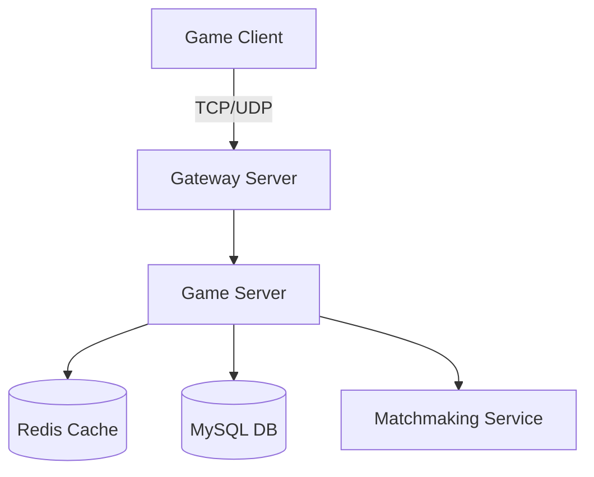

# 협업과 프로세스

## 1. 애자일/스크럼 경험

### 스프린트 운영

**Q: 스크럼 프로세스에서의 경험을 설명해주세요.**

**답변 예시:**

"2주 스프린트로 운영한 경험:

**스프린트 구조:**
```
Week 1 (월): Sprint Planning
- 스토리 포인트 산정 (피보나치: 1,2,3,5,8,13)
- 팀 속도(Velocity): 평균 40포인트
- 버퍼 20% 확보

Week 1-2: Development
- 일일 스탠드업 (15분)
- 블로커 즉시 해결
- 페어 프로그래밍

Week 2 (금): Sprint Review & Retrospective
- 데모 시연
- 개선사항 도출
```

**실제 적용 사례:**
```cpp
// 스프린트 태스크 예시
class MatchmakingFeature {
    // Sprint 1: 기본 매칭 (8 points)
    void BasicMatching() {
        // 단순 FIFO 매칭
    }
    
    // Sprint 2: 스킬 기반 매칭 (13 points)
    void SkillBasedMatching() {
        // MMR 계산 및 매칭
    }
    
    // Sprint 3: 파티 매칭 (21 points)
    void PartyMatching() {
        // 그룹 단위 매칭
    }
};
```

**개선 효과:**
- 예측 가능성 향상: 80% 정확도
- 품질 향상: 버그 50% 감소
- 팀 만족도: 4.2/5.0"

### 백로그 관리

**Q: 기술 부채를 어떻게 관리했나요?**

**답변 예시:**

"기술 부채 관리 프로세스:

**1. 부채 추적:**
```cpp
// 기술 부채 태그 사용
// TODO: [TECH-DEBT] O(n²) 알고리즘, 1000명 이상에서 성능 이슈
void FindNearbyPlayers(Player& player) {
    for (auto& other : allPlayers) {
        if (Distance(player, other) < NEARBY_RANGE) {
            // 처리
        }
    }
}
```

**2. 정량화:**
- 성능 부채: 응답시간 영향도
- 보안 부채: 위험도 점수
- 유지보수 부채: 수정 빈도

**3. 스프린트 할당:**
- 20% 룰: 각 스프린트의 20%는 기술 부채
- 부채 스프린트: 분기별 1회 전체 할당

**4. 우선순위:**
```
P0: 보안 취약점
P1: 성능 병목
P2: 코드 품질
P3: 문서화
```

**결과:**
- 기술 부채 50% 감소
- 장애 발생률 70% 감소
- 개발 속도 30% 향상"

## 2. 코드 리뷰 문화

### 효과적인 코드 리뷰

**Q: 코드 리뷰 프로세스와 경험을 공유해주세요.**

**답변 예시:**

"코드 리뷰 가이드라인 수립 및 운영:

**리뷰 체크리스트:**
```markdown
## 코드 리뷰 체크리스트
- [ ] 기능 요구사항 충족
- [ ] 테스트 코드 포함
- [ ] 성능 고려사항
- [ ] 보안 취약점
- [ ] 에러 처리
- [ ] 문서화
```

**건설적인 피드백 예시:**
```cpp
// ❌ 나쁜 리뷰
"이 코드는 별로네요. 다시 작성하세요."

// ✅ 좋은 리뷰
"이 부분에서 race condition이 발생할 수 있습니다.
현재:
void UpdateScore(int playerId, int delta) {
    players[playerId].score += delta;  // 동시 접근 문제
}

제안:
void UpdateScore(int playerId, int delta) {
    lock_guard<mutex> lock(playerMutex[playerId]);
    players[playerId].score += delta;
}

또는 atomic 연산을 고려해보시면 좋겠습니다:
atomic<int> score;
score.fetch_add(delta);
"
```

**리뷰 문화 개선:**
1. **양방향 학습**: 주니어도 시니어 코드 리뷰
2. **긍정적 피드백**: 좋은 코드도 언급
3. **자동화**: 린터, 포맷터로 스타일 논쟁 제거

**성과:**
- 코드 품질 지표 40% 개선
- 지식 공유 활성화
- 버그 조기 발견율 60%"

### PR 관리

**Q: Pull Request 워크플로우를 어떻게 관리했나요?**

**답변 예시:**

"체계적인 PR 프로세스:

**PR 템플릿:**
```markdown
## 변경 사항
- 매칭 알고리즘 최적화
- 레디스 캐싱 추가

## 테스트
- [x] 유닛 테스트 추가
- [x] 통합 테스트 통과
- [x] 성능 테스트 (레이턴시 50ms → 10ms)

## 체크리스트
- [x] 코드 컨벤션 준수
- [x] 문서 업데이트
- [x] 변경 로그 작성
```

**브랜치 전략:**
```bash
main
├── develop
│   ├── feature/matching-system
│   ├── feature/chat-upgrade
│   └── hotfix/memory-leak
└── release/v1.2.0
```

**자동화 파이프라인:**
```yaml
name: PR Validation
on: [pull_request]

jobs:
  validate:
    steps:
    - name: Build
      run: make build
    
    - name: Test
      run: make test
    
    - name: Code Coverage
      run: |
        make coverage
        if [ $(coverage) -lt 80 ]; then
          exit 1
        fi
    
    - name: Static Analysis
      run: |
        cppcheck --enable=all src/
        clang-tidy src/*.cpp
```

**머지 규칙:**
- 최소 2명 승인
- 모든 테스트 통과
- 충돌 해결
- 1일 내 머지 (신선도 유지)"

## 3. 타 부서 협업

### 기획팀과의 협업

**Q: 기획팀과 어떻게 협업했나요?**

**답변 예시:**

"기획-개발 협업 프로세스:

**1. 초기 기획 단계 참여:**
```
기획서 검토 체크리스트:
□ 기술적 타당성
□ 성능 영향도
□ 개발 일정
□ 리스크 요소
```

**2. 프로토타이핑:**
```cpp
// 빠른 프로토타입으로 기획 검증
class PrototypeSkillSystem {
    void TestSkillCombination() {
        // 1일 내 구현
        // 기획팀이 직접 테스트
        // 피드백 즉시 반영
    }
};
```

**3. 데이터 기반 소통:**
```
"이 스킬은 서버에서 초당 1000번 계산됩니다.
현재 CPU 사용률: 60%
스킬 추가 시: 85% (위험)
대안: 쿨다운 2초 → 5초로 조정하면 70% 유지"
```

**4. 정기 싱크업:**
- 주간 기획-개발 미팅
- 스프린트 데모 참여
- 긴급 이슈 핫라인

**성과:**
- 재작업 80% 감소
- 기획-개발 일정 차이 최소화
- 상호 이해도 향상"

### QA팀과의 협업

**Q: QA팀과 효율적으로 협업한 방법은?**

**답변 예시:**

"QA 협업 최적화:

**1. 테스트 자동화 지원:**
```cpp
// QA가 사용할 수 있는 테스트 API 제공
class TestAPI {
    void SimulatePlayerLoad(int count) {
        for (int i = 0; i < count; i++) {
            auto bot = CreateBot();
            bot->RandomActions();
        }
    }
    
    void TriggerScenario(string scenarioName) {
        // QA가 정의한 시나리오 실행
    }
};
```

**2. 디버깅 도구 제공:**
```cpp
// 실시간 상태 조회
class DebugConsole {
    void ShowPlayerState(int playerId) {
        // 플레이어 상태 상세 정보
        // 네트워크 로그
        // 최근 행동 이력
    }
};
```

**3. 버그 리포트 표준화:**
```markdown
## 버그 리포트 템플릿
**환경:** Production Server #3
**재현 단계:**
1. A 스킬 사용
2. 0.1초 내 B 스킬 사용
3. 서버 크래시

**예상 동작:** 스킬 순차 처리
**실제 동작:** 서버 다운

**로그:** [첨부]
**덤프 파일:** [링크]
```

**4. 조기 QA 참여:**
- 개발 중 일일 빌드 제공
- QA 피드백 즉시 반영
- 테스트 케이스 공동 작성

**결과:**
- 버그 발견-수정 사이클 50% 단축
- 치명적 버그 90% 감소
- QA-개발 신뢰 관계 구축"

## 4. 문서화와 지식 공유

### 기술 문서 작성

**Q: 효과적인 문서화 방법은?**

**답변 예시:**

"실용적인 문서화 전략:

**1. 코드 내 문서화:**
```cpp
/**
 * @brief 플레이어 매칭 시스템
 * 
 * 스킬 레벨 기반으로 공정한 매칭을 수행합니다.
 * 
 * @note 동시 매칭 요청은 최대 10,000건까지 처리 가능
 * @warning 매칭 풀이 비어있으면 무한 대기 가능
 * 
 * @param player 매칭을 요청한 플레이어
 * @param timeout 최대 대기 시간 (기본: 60초)
 * @return 매칭된 상대 플레이어 목록
 * 
 * @example
 * auto opponents = matchmaker.FindMatch(player, 30s);
 * if (opponents.empty()) {
 *     // 매칭 실패 처리
 * }
 */
vector<Player*> FindMatch(Player& player, duration timeout = 60s);
```

**2. 아키텍처 문서:**


**3. 운영 가이드:**
- 트러블슈팅 가이드
- 성능 튜닝 매뉴얼
- 모니터링 대시보드 사용법

**4. API 문서 자동화:**
```bash
# Doxygen으로 자동 생성
doxygen Doxyfile
# Swagger로 REST API 문서화
```

**효과:**
- 온보딩 시간 70% 단축
- 반복 질문 80% 감소
- 지식 단일화"

### 기술 공유 세션

**Q: 팀 내 지식 공유를 어떻게 활성화했나요?**

**답변 예시:**

"지식 공유 문화 구축:

**1. 정기 Tech Talk:**
- 격주 금요일 1시간
- 발표자 로테이션
- 외부 발표 리허설 기회

**2. 코드 리딩 세션:**
```cpp
// 복잡한 코드 함께 분석
class LockFreeQueue {
    // 30분간 구현 설명
    // 장단점 토론
    // 개선 아이디어 도출
};
```

**3. 포스트모템 공유:**
- 장애 원인 분석
- 해결 과정 공유
- 재발 방지책

**4. 내부 위키:**
- 트러블슈팅 DB
- 베스트 프랙티스
- 기술 결정 로그

**성과:**
- 팀 전체 기술력 향상
- 사일로 현상 해소
- 혁신적 아이디어 도출"

## 5. 리모트 협업

### 원격 근무 환경

**Q: 리모트 환경에서 어떻게 협업했나요?**

**답변 예시:**

"효과적인 원격 협업:

**1. 비동기 커뮤니케이션:**
- 상세한 PR 설명
- 이슈 트래커 활용
- 문서 우선 문화

**2. 동기화 포인트:**
```
일일 스탠드업 (10:00 AM)
- 화상 회의 필수
- 15분 타임박스
- 액션 아이템 정리

주간 스프린트 체크인
- 진행 상황 공유
- 블로커 해결
```

**3. 도구 활용:**
- Slack: 실시간 소통
- Notion: 문서 협업
- Miro: 화이트보드
- VS Code Live Share: 페어 프로그래밍

**4. 팀 빌딩:**
- 가상 커피 타임
- 온라인 게임 세션
- 월간 오프라인 미팅

**결과:**
- 생산성 유지
- 워라밸 개선
- 글로벌 인재 확보"

## 면접 체크포인트

1. **프로세스 개선 경험**: 단순 따르기보다 개선
2. **도구 활용 능력**: 적절한 도구 선택과 활용
3. **커뮤니케이션 스킬**: 명확하고 효과적인 소통
4. **문제 해결 접근**: 체계적이고 협력적
5. **문화 구축**: 긍정적 팀 문화 기여