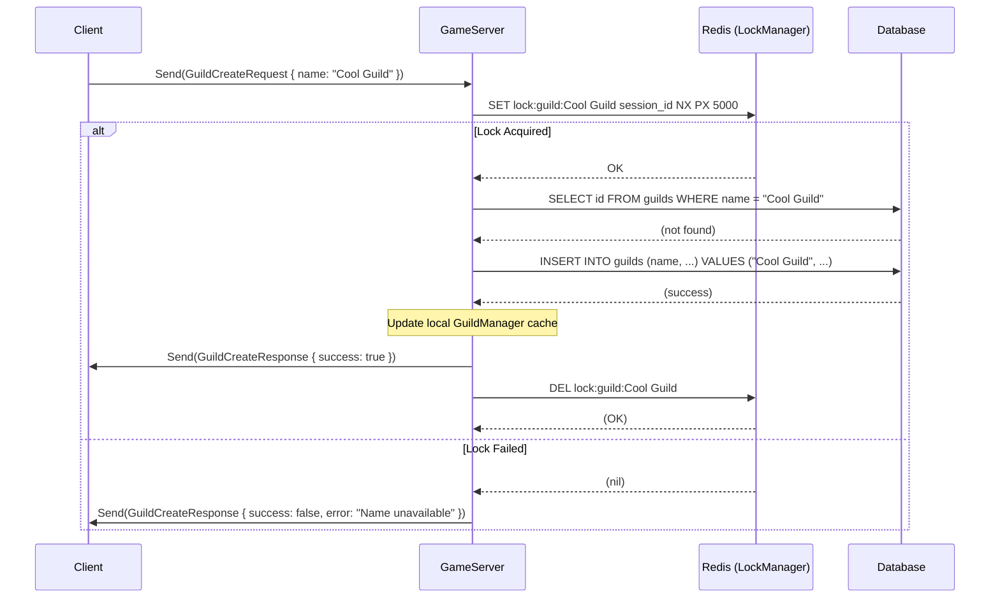

# Extension 10: Guild Creation Transaction Scenario

## 1. Objective

This guide details how to handle a critical distributed transaction: guild creation. The goal is to prevent a race condition where two players attempt to create a guild with the same name simultaneously. We will leverage the existing `DistributedLockManager` (which uses Redis) to ensure that guild creation is an atomic, transactional operation across a distributed server environment.

## 2. Analysis of Current Implementation

*   **The Problem**: The current `GuildManager::CreateGuild` method is not thread-safe and is not designed for a distributed environment. If two separate server instances (or even two threads on the same instance) call `CreateGuild("SameName", ...)` at the same time, both would likely succeed in their local memory, leading to data inconsistency in the database.
*   **The Tool**: The `DistributedLockManager` class already exists and provides the necessary functionality (`Lock`, `Unlock`) to solve this problem. 
*   **The Gap**: The guild creation logic (likely in a packet handler) does not currently use the `DistributedLockManager`. 

This guide will bridge that gap.

## 3. Proposed Implementation

We will implement the transactional logic within the packet handler for `GuildCreateRequest`.

### Step 3.1: Designing the Transactional Flow

The correct sequence of operations for creating a guild transactionally is:
1.  Receive the `GuildCreateRequest`.
2.  Construct a unique lock key from the guild name (e.g., `lock:guild:the-guild-name`).
3.  Attempt to acquire a distributed lock using `DistributedLockManager::Lock()`.
4.  **If the lock fails**: The guild name is already being created. Respond to the user with a "Name taken or currently being processed" error.
5.  **If the lock succeeds**: 
    a. Check the database to ensure the name doesn't already exist (double-check).
    b. Create the guild in the database.
    c. Update any relevant caches (e.g., a Redis cache of guild names).
    d. Call `GuildManager::CreateGuild` to update the local in-memory state.
    e. Respond to the user with a success message.
6.  **Finally**: Release the distributed lock using `DistributedLockManager::Unlock()`.

### Step 3.2: Implementing the Packet Handler

Here is the conceptual code for the `GuildCreateRequest` packet handler.

**Conceptual Code (`packet_handler.cpp` or wherever handlers are registered):**
```cpp
#include "database/distributed_lock_manager.h"
#include "game/social/guild_manager.h"
#include <chrono>

void RegisterGuildPacketHandlers(PacketHandler& packetHandler) {
    packetHandler.RegisterHandler(mmorpg::proto::GuildCreateRequest::descriptor(),
        [](std::shared_ptr<Session> session, const google::protobuf::Message& msg) {
            const auto& req = static_cast<const mmorpg::proto::GuildCreateRequest&>(msg);
            const std::string& guild_name = req.guild_name();

            // 1. Define the lock key
            std::string lock_key = "lock:guild:" + guild_name;
            auto& lock_manager = mmorpg::database::DistributedLockManager::Instance();

            // 2. Attempt to acquire the lock (e.g., with a 5-second TTL)
            if (lock_manager.Lock(lock_key, session->GetSessionId(), std::chrono::seconds(5))) {
                // --- LOCK ACQUIRED --- 
                try {
                    // 3a. Double-check if guild name exists in DB (critical read)
                    // bool exists = GuildDatabase::DoesGuildExist(guild_name);
                    // if (exists) { ... respond with error ... }

                    // 3b. Create guild in the database
                    // GuildDatabase::CreateGuild(guild_name, ...);

                    // 3c. Update local memory state
                    mmorpg::game::social::GuildManager::Instance().CreateGuild(guild_name, /*...*/);

                    // 3d. Respond with success
                    // proto::GuildCreateResponse res; res.set_success(true);
                    // session->Send(res);

                } catch (const std::exception& e) {
                    LOG_ERROR("Error during guild creation for {}: {}", guild_name, e.what());
                    // Respond with a failure message
                }

                // 4. ALWAYS release the lock
                lock_manager.Unlock(lock_key);
                // --- LOCK RELEASED ---

            } else {
                // --- LOCK FAILED ---
                // Another process is currently creating a guild with this name.
                // Respond with a "name is taken or being processed" error.
                // proto::GuildCreateResponse res; res.set_success(false); res.set_error_message("Name unavailable");
                // session->Send(res);
            }
        });
}
```

### Step 3.3: Visualizing the Flow with a Sequence Diagram

This Mermaid.js diagram illustrates the entire process, showing the interaction between the client, server, Redis, and the database.



## 4. Rationale for Design

*   **Pessimistic Locking**: This approach is called pessimistic locking. We assume a conflict *might* happen, so we acquire a lock *before* performing any critical work. This is the safest pattern for operations that must be strictly atomic and have low contention.
*   **Lock Key**: The lock key (`lock:guild:guild-name`) is specific to the resource we are protecting (the guild name). This ensures that the creation of two different guilds (e.g., "Guild A" and "Guild B") can happen in parallel without blocking each other.
*   **Lock TTL (Time-To-Live)**: Setting a TTL on the lock (e.g., 5 seconds) is a crucial safety measure. If the server crashes while holding the lock, the lock will automatically expire in Redis, preventing a permanent deadlock.
*   **`try...finally` (RAII)**: The C++ code should use an RAII-style lock guard to ensure the lock is *always* released, even if an exception occurs during the database operations. The `try...catch` block in the example serves a similar purpose.

## 5. How to Use This Document

This document should be placed in a `docs/transactions` or similar directory within the project. It serves as a reference for:
*   **New Developers**: To understand how to correctly handle distributed state changes.
*   **Code Review**: As a checklist to ensure that new features involving shared resources are implemented safely.
*   **Architectural Discussions**: As a concrete example of the project's approach to handling concurrency.
